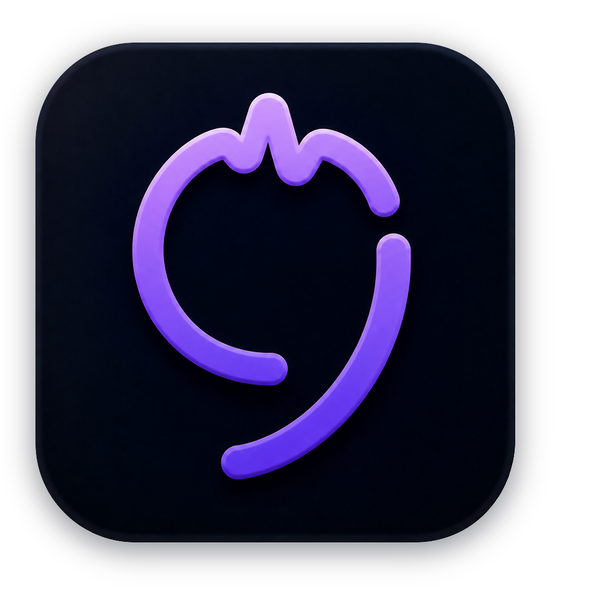

# Transcriber

<p align="center">
  
</p>

[](https://github.com/yhn112/Transcriber/actions/workflows/build.yml)
[](https://github.com/yhn112/Transcriber/actions/workflows/codeql.yml)
[](https://codecov.io/gh/yhn112/Transcriber)
[](project.yml)
[](project.yml)
[](LICENSE)

A local meeting transcriber for macOS. A menu-bar app records the microphone and system
audio during a call, transcribes the recording, and produces a summary. Meetings are held
in Russian and English, often mixed.

Recordings, transcripts, and summaries stay on the machine. Audio or text leaves it only
when the user explicitly enables a cloud engine, and the UI shows when that is on.

Two things follow from capturing locally rather than joining the call as a bot: it works
with any calling service, and the microphone and the system output arrive as two separate
channels. That second one is free first-level diarization — "me" versus "everyone else" —
with no model and no error, so the two tracks are written to two files and never mixed.

## Status

Under active development, and not yet a usable product: recording works, the pipeline that
turns a recording into a transcript does not run inside the app yet. [`PLAN.md`](PLAN.md)
names the current stage and the criterion that ends it.

## Building

Requires macOS on Apple silicon and Xcode. The environment, the setup commands, and the
rules that govern changes are in [`AGENTS.md`](AGENTS.md); `scripts/doctor.sh` reports what
this machine is missing and where each piece comes from. `Transcriber.xcodeproj` is
generated from `project.yml` by XcodeGen and is deliberately not in the repository.

## Running a build

The newest build of `main` is a disk image on the [Releases](../../releases) page, replaced
by every push; a build of any other branch is attached to its own CI run under Artifacts. Both
are ad-hoc signed and deliberately not notarized — this project is not distributed — so macOS
quarantines the image on download and refuses to open it. Drag the app to Applications, then:

```bash
sudo xattr -dr com.apple.quarantine /Applications/Transcriber.app
```

## Permissions

Recording needs two grants, and they are granted independently, so exactly one of them
missing is what a single silent track looks like:

- **Microphone** — System Settings › Privacy & Security › Microphone. The app asks the first
  time you record.
- **Audio Recording** — System Settings › Privacy & Security › Audio Recording. This is the
  system side, captured through a CoreAudio process tap. macOS offers no way to ask for it up
  front, so the prompt appears when a recording first taps the output.

Screen Recording is not among them and never will be: requesting it for audio-only capture is
a trade this project does not make.

macOS binds both grants to the app's signature. A locally built app keeps them across
rebuilds, which is the whole reason `scripts/make-signing-cert.sh` exists; a CI build is
ad-hoc signed and is therefore a different app to the system every time, so a downloaded one
inherits nothing from the one before it. A recording that comes out silent with no prompt at
all is that, rather than a fault in capture —
[`.agents/skills/audio-doctor/SKILL.md`](.agents/skills/audio-doctor/SKILL.md) has the reset.

## Where things are written down

| | |
|---|---|
| [`AGENTS.md`](AGENTS.md) | Environment, rules, and conventions. The authoritative one. |
| [`PLAN.md`](PLAN.md) | Product scope and staging. |
| [`docs/`](docs) | Measurements, API research, decisions, procedure. |
| [`.agents/`](.agents) | Reusable skills and delegated-role definitions. |

Every fact lives in exactly one of those; anything else points at it rather than
restating it.

## License

MIT — see [`LICENSE`](LICENSE).
